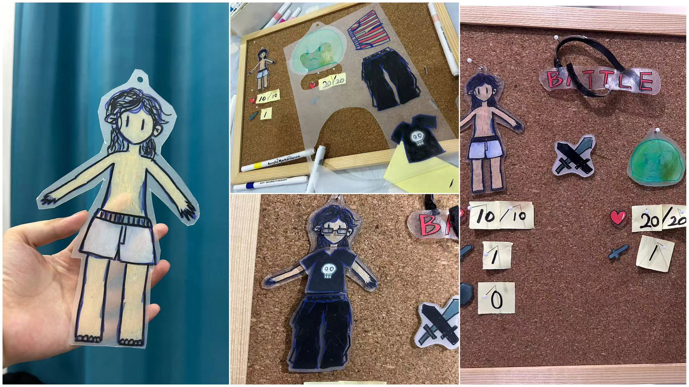
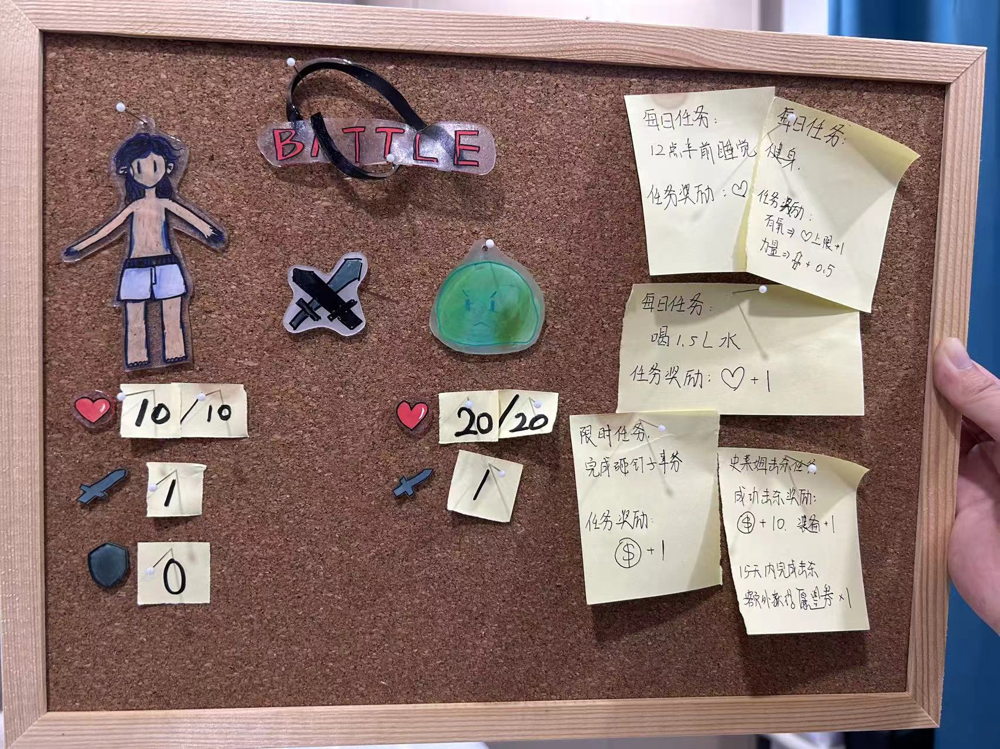

重新开始健身，在「乐刻」开通健身卡已经接近两个月，9月份的前20天都没有进行任何健身活动。健身是世界上确定的为数不多努力就会有收获的事，但是健身的过程是十分枯燥的，在面对生活中更多轻松舒适的众多选择中，选择健身一件困难的事，它将要带来的遥遥无期的收获伴随的是近在眼前触手可及的痛苦。

我的女朋友WPP，为了激励我进行健身活动，发挥了她的艺术创作和游戏设计的才能，使用热缩片创作了一个“勇者救公主”为故事背景的健身看板（灵感来自Habitica）。和众多的勇者游戏一样，我的第一个敌人是一只不太高兴的史莱姆👇🏻

在这个看板中包含了战斗系统和任务系统，以及一个正在制作的装备系统，目前这个看板的机制还比较简单，大致包括：

- 运动可以增加角色属性
- 每日任务可以恢复血量
- 即时任务、击杀史莱姆可以获得金币
- 金币可以用来获取新的装备

非常有趣！在看板启用的第一天，我通过健身获得了 +0.5 ATK，和史莱姆战斗 -1 HP，完成喝水任务 +1 HP，结算之后看板的变化是 +0.5 ATK，史莱姆 -1HP。好像正在一点点朝着好的方向发展。

第一天的运动之后感觉不错，但是在之后的几天中，明显感受到工作十分疲惫，身体并没有适应这种作息的强度。我形容这是一种意识脱离身体半厘米的状态。

在看板启用的第2天暂停了运动，这是我连续运动的第4天，我感觉到我现实中的身体疲惫不堪。如果这一天要健身，我一般会在早上6点左右起床，然后去健身房运动大约1小时左右，这在日程表上算得上是见缝插针的安排，起床、去健身房的路程、运动前后的事项......几乎也要花掉一个小时的时间。

接下来需要优化健身的时间和间歇，渐渐习惯生活中增加健身这一事项。

