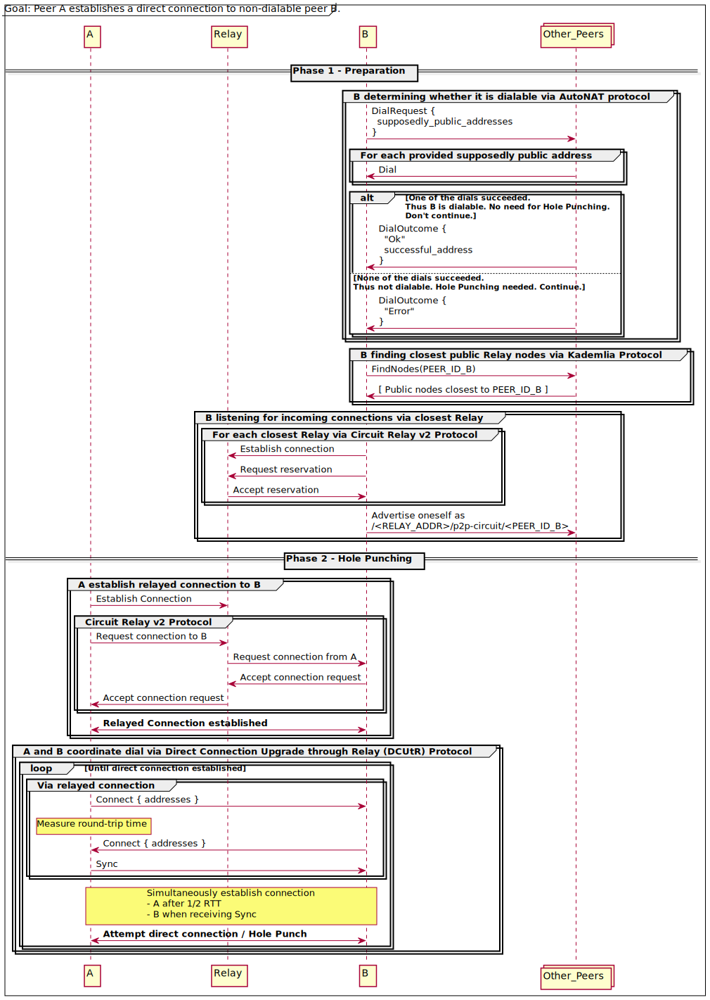

# NATS
## 概览

因特网由无数的网络组成，这些网络通过基础传输协议绑定到共享的地址空间中。

当流量在网络边界之间移动时，通常会发生称为网络地址转换的过程。NAT （Network Address Translation）是一种将地
址从一个地址空间映射到另一个地址空间的技术。

NAT允许许多机器共享一个公共地址，它对于IPv4协议的持续运作至关重要，否则它将无法满足现代网络人口的32位地址空间的需求。

例如，当我连接到家里的wifi时，我的电脑得到一个IPv4地址`10.0.1.15`。这是保留给私有网络内部使用的IP地址范围的一部分。当我向一个公共IP地址发出连接时，路由器用它自己的公共IP地址替换我的内部IP地址。当数据从另一端返回时，路由器将转换回内部地址。

虽然NAT对于传出连接通常是透明的，但是侦听传入连接需要一些配置。路由器监听单个公共IP地址，但是内部网络上的任何数量的机器都可以处理请求。为了服务请求，你的路由器必须配置为发送特定的流量到特定的机器，通常是通过将一个或多个TCP或UDP端口从公共IP映射到内部IP。

虽然通常可以手动配置路由器，但并不是每个想要运行点对点应用程序或其他网络服务的人都有能力这样做。
我们希望libp2p应用程序可以在任何地方运行，而不仅仅是在数据中心或具有稳定公共IP地址的机器上。为了实现这一点，下面是目前libp2p中可用的NAT遍历的主要方法。

## 自动路由器配置

许多路由器支持端口转发的自动配置协议，最常见的是[UPnP](https://en.wikipedia.org/wiki/Universal_Plug_and_Play)或[nat-pmp](https://en.wikipedia.org/wiki/NAT_Port_Mapping_Protocol)。

如果您的路由器支持其中一种协议，libp2p将尝试自动配置一个端口映射，以允许它侦听传入的通信。如果网络和libp2p实现支持，这通常是最简单的选项。

#  AutoNAT
## 背景

虽然识别协议允许对等节点相互通知它们观察到的网络地址，但有时这些地址是不可访问的，因为对等节点可能位于私有网络中（即，在NAT或防火墙后面）。

> 不可到达的广告地址对P2P网络的健康是有害的，因为其他节点将无法成功地尝试拨打这些地址，从而浪费计算和网络资源。

为了防止广告和拨号不可达地址的问题，libp2p实现了一种称为AutoNAT的协议，该协议允许节点确定它们是否在NAT后面。

## 什么是AutoNAT?

AutoNAT允许节点请求其他节点拨打其假定的公共地址。

对于位于NAT后面的私有节点，强烈建议：

- 不通告私有地址
- 使用中继进行预订，以改善到公共网络的连接性，而不是发布中继地址

对于公有节点，建议：

- 启动中继以协助其他节点
- 考虑激活DHT服务器模式以改善到公共网络的连接性
- 如果大多数拨号尝试都成功，则节点可以合理地确定它没有在NAT后面。另一方面，如果大多数拨号尝试失败，则强烈表明NAT正在阻止传入连接

> 目前，AutoNAT不能测试单个地址，但是AutoNAT v2的提议旨在添加此功能。

AutoNAT协议使用协议ID `/libp2p/ AutoNAT /1.0.0`，包括`Dial`和`DialResponse`消息的交换。

为了启动该协议，一个节点向另一个对等节点发送一个包含多地址列表的`Dial`消息。然后，对等节点尝试使用与常规libp2p连接不同的IP和对等体ID来拨号这些地址。如果至少有一次拨号成功，对等体将向请求节点发送一个带有`ResponseStatus: SUCCESS`的`DialResponse`消息。

如果所有拨号都失败，对等体将发送一个`DialResponse`消息`ResponseStatus: E_DIAL_ERROR`。请求节点可以使用来自对等端的响应来确定它是否在NAT后面。

> 如果响应表明成功，则该节点可能不在NAT后面，并且不需要使用中继服务器来改善其连通性。如果响应指示错误，则该节点可能在NAT之后，可能需要使用中继服务器与网络中的其他节点进行通信。

为了防止某些类型的攻击，libp2p的AutoNAT实现不能拨号任何不基于请求节点的IP地址的多地址，也不能通过中继连接接受拨号请求（因为无法验证通过中继连接到达的节点的IP地址）。

这是为了防止放大攻击，在放大攻击中，攻击者向许多客户端提供指向预定目标的相同伪造的[MAPPED-ADDRESS](https://www.rfc-editor.org/rfc/rfc3489#section-11.2.1)，导致所有流量都集中在目标上。

> 💡See the AutoNAT [technical specification](https://github.com/libp2p/specs/blob/master/autonat/README.md) for more details.

# 线路中继（Cicuit Relay）

## What is Circuit Relay?

Circuit Relay 是一种传输协议，通过第三方 "中继" 节点来转发两个节点之间的流量。

在许多情况下，节点无法穿透其 NAT（网络地址转换）或防火墙，无法使其公开可访问。或者，它们可能不共享可以直接通信的公共传输协议。

为了解决类似 NAT 等连接障碍，libp2p 定义了一种名为 [**p2p-circuit** ](https://github.com/libp2p/specs/tree/master/relay)的协议。当某个节点无法监听公共地址时，它可以向中继节点发起连接，中继节点将保持一个长期连接。其他节点可以通过 **p2p-circuit** 地址拨号连接到中继节点，后者会将流量转发到目标节点。

Cicuit Relay协议的灵感来源于 [TURN](https://tools.ietf.org/html/rfc5766)（Traversal Using Relays around NAT），它是 NAT 穿透技术的[交互式连接建立](https://tools.ietf.org/html/rfc8445)的一部分。

> 中继连接是端到端加密的，这意味着充当中继的对等体无法读取或篡改流经该连接的任何通信。

中继协议的一个重要特性是它并非“透明”的。换句话说，源节点和目标节点都知道它们的流量正在被中继转发。这种设计非常有用，因为目标节点能够看到用于建立连接的中继地址，并可能使用该地址构建返回源节点的路径。此外，这种通信也不是匿名的——所有参与者，包括中继节点，都通过其 **Peer ID** 进行标识。

这种非透明性可以帮助实现连接的可追溯性，确保所有通信方可以识别彼此的身份，增强了网络的安全性和控制力，尤其是在需要进行后续双向通信时。

## 协议版本

目前有两个版本的中继协议，[v1](https://github.com/libp2p/specs/blob/master/relay/circuit-v1.md)和[v2](https://github.com/libp2p/specs/blob/master/relay/circuit-v2.md)。我们建议使用后者而不是前者。有关两者的详细比较，请参阅[circuit relay v2 specification](https://github.com/libp2p/specs/blob/master/relay/circuit-v2.md#introduction)。如果没有明确说明，本文档描述了线路中继v2协议。

## 中继地址

中继电路（Relay Circuit）在 libp2p 中使用一种 [multiaddr](https://docs.libp2p.io/concepts/appendix/glossary/#multiaddr)进行标识，包含要中继流量的节点的[Peer ID](https://docs.libp2p.io/concepts/fundamentals/peers/#peer-id)（即监听节点或“中继目标”）。
例如，如果我有一个 libp2p 节点，Peer ID 是 **QmAlice**，而且我在 NAT 后面，其他人无法直接拨号访问我。为了让我的朋友 **QmBob** 可以连接到我，我可以使用中继节点的帮助。

最基本的 **p2p-circuit** 地址如下所示：

```
/p2p-circuit/p2p/QmAlice
```

该地址没有包含具体的传输地址，这意味着其他节点只能通过发现一个合适的中继节点，并期望中继节点已经和我有连接。然而，更好的方法是明确指定中继节点的地址，例如：

```
/p2p/QmRelay/p2p-circuit/p2p/QmAlice
```

这个地址包括了中继节点的身份（Peer ID：**QmRelay**）。如果其他节点知道如何与 **QmRelay** 建立连接，他们就可以通过中继节点到达我。

更完整的地址还包括中继节点的传输地址信息。假设中继节点 **QmRelay** 监听 **198.51.100.0** 上的 TCP 端口 **55555**，可以构建如下路径：

```
/ip4/198.51.100.0/tcp/55555/p2p/QmRelay/p2p-circuit/p2p/QmAlice
```

在这个地址中，**/p2p-circuit/** 之前的部分是中继节点的地址信息，包含传输地址和 Peer ID。**/p2p-circuit/** 之后的部分是目标节点的 Peer ID **QmAlice**。通过将这个完整的中继路径地址提供给 **QmBob**，他可以快速建立连接，而不需要再“询问”是否有可用的中继节点能连接到 **QmAlice**。

这一机制有效解决了NAT穿透问题，使得在去中心化的 P2P 网络中，节点可以通过中继实现连接。

> 当发布您的地址时，最好提供中继地址，其中包括中继对等体的传输地址。
> 如果中继有许多传输地址，您可以通过它们中的任何一个发布一个`p2p-circuit`。

## 过程

下面的顺序图描述了一个示例中继过程：


在这个场景中，Node A 位于 NAT 或防火墙后，无法通过直接的公网地址进行通信。通过 **AutoNAT** 服务，Node A 检测到自己无法对外公开地址，因此请求中继节点 **R** 进行**预留**（Reservation），即请求 **R** 代表自己监听传入的连接。

流程如下：

1. 节点A位于NAT和/或防火墙后面，例如通过 [AutoNAT service](https://docs.libp2p.io/concepts/nat/autonat/)检测到。
2. **Node A 请求预留**：Node A 向中继节点 **R** 发出请求，要求它为自己预留地址并代为监听外部的连接请求。通过这种方式，其他节点可以通过 **R** 连接到 **A**。
3. **Node B 请求与 Node A 建立连接**：由于 **A** 没有公开直接可达的地址，Node B 只能通过 **A** 提供的中继地址来发起连接。Node B 向中继节点 **R** 发送连接请求，要求中继 **R** 转发连接到 **A**。
4. **中继节点 R 处理连接**：中继 **R** 接收到 **B** 的请求后，会将该请求转发给 **A**。之后，**R** 充当数据转发器，负责将 **A** 和 **B** 之间的所有数据进行中继转发。

整个过程是通过 libp2p 的 **p2p-circuit** 协议实现的，它能够帮助 NAT 后的节点通过中继节点进行通信，从而解决 NAT 穿透问题，保障 P2P 网络的连通性。

# DCUtR
## 背景
使用中继作为代理来遍历nat，但是这在扩展和维护方面的成本可能很高，并且可能导致低带宽、高延迟的连接。[Hole punching](https://docs.libp2p.io/concepts/nat/hole-punching/)（打洞）是另一种通过使NAT后面的两个节点直接通信来实现NAT穿透的技术。然而，除了中继节点之外，它还需要另一个称为信令服务器（[signaling server](https://docs.libp2p.io/concepts/nat/appendix/glossary.md#signaling-server)）的基础设施。

好消息是libp2p提供了一个打洞解决方案，它消除了对集中式信令服务器的需求，并允许使用分布式中继节点。

## 什么是通过中继直接连接升级？

libp2p DCUtR （Direct Connection Upgrade through Relay）是一种通过打洞在节点之间建立直接连接的协议，不需要信令服务器。DCUtR包括同步和打开到每个对等端预测的外部地址的连接。

DCUtR协议使用协议ID /libp2p/ DCUtR，包括Connect和Sync消息的交换。

DCUtR协议支持TCP、QUIC等不同类型的连接，不同类型的连接建立过程不同。

@Dennis-tra有一个关于dcur和它的打洞成功率的[great talk](https://www.youtube.com/watch?v=fyhZWlDbcyM)。

了解NAT遍历如何工作的有用资源是Tailscale的[this blog post](https://tailscale.com/blog/how-nat-traversal-works/)。

> 💡详细信息请参见DCUtR技术规范（[technical specification](https://github.com/libp2p/specs/blob/master/relay/DCUtR.md)）。

# Hole Punching

点对点网络上的节点可以分为公共和非公共两类。公共节点是那些可以不受阻碍地访问互联网的节点，而非公共节点位于某种防火墙后面。这适用于家庭和公司网络的大多数节点，以及移动电话。在大多数配置中，公共和非公共节点都可以拨号连接到其他公共节点。但是，不可能建立从公共互联网到非公共节点的连接。

## 拨号非公共节点

这里有一些节点可以用来拨号非公共节点的方法：

- UPnP（通用即插即用）：路由器和网络内计算机之间使用的协议。它允许计算机请求某些端口被打开并转发到该计算机。
- 端口转发：在路由器上手动配置端口转发。
## 限制

在许多情况下，UPnP被路由器或防火墙禁用。UPnP也可能无法工作，这取决于路由器的固件。

手动打开端口需要专业技术，并且不强制进行身份验证或授权。

## 可能的解决方案：hole punching

### 中继概览

中继是一种用于在两端之间发送信息的机制。对于非公有节点：

节点A与中继节点R保持永久连接，当节点B想要连接到节点A时，它首先与节点R建立连接，节点R转发该连接上的所有数据包。中继增加了额外的延迟，并且是资源密集型的，因为节点R需要处理大量的流量。使用中继节点还需要技术专业知识。

### 如果我们可以使用节点R来帮助促进节点A和节点B之间的直接连接呢？

在其他选择都不够的情况下，网络可以使用一种称为打洞的技术来与非公共节点建立连接。

每个节点连接到中继节点并共享其外部地址和端口信息。服务器临时存储节点的信息，并将每个节点的信息转发给其他节点。客户端可以使用这些信息建立彼此之间的直接连接。

以两个节点A和B为例，它们想要相互拨号：
1. 两个节点的第一个数据包（例如，在TCP的情况下，一个SYN）通过它们各自的路由器。
1. 路由器将一个5元组添加到路由器的状态表中。

   > 💡路由器状态表（路由表）是存储在路由器中的数据，它列出了到特定网络目的地的路由。5元组结构包括源IP地址、源端口、目的IP地址、目的端口和传输协议。

1. PacketA和PacketB在各自路由器的防火墙上“打洞”。
1. 两个包到达对方的路由器。
1. 当A的数据包到达Router_B时，Router_B检查自己的状态表，发现一个5元组是在节点B发送的数据包中添加的。
1. 路由器通过“打洞”将数据包转发给B。B的数据包也是如此；到达Router_A后，在Router_A的状态表中匹配一个5元组，将报文转发给A。

下面的用例图说明了上面的过程。（图片显示似乎有些问题，请点击右键-在新标签页中打开链接）

> 这个过程假定了一种同时同步A和B的机制。

### Hole punching in libp2p

受[ICE协议](https://datatracker.ietf.org/doc/html/rfc8445)的启发，libp2p包括一个分散的穿孔功能，允许防火墙和NAT穿越，而不需要像STUN和TURN这样的中央协调服务器。

下面的顺序图说明了整个过程。



Libp2p打洞可分为两个阶段，准备阶段和打洞阶段。

#### 第一阶段：准备

1. [AutoNAT](https://docs.libp2p.io/concepts/nat/autonat/)：确定节点是否可拨号，例如，发现节点是否在NAT或防火墙后面。

2. AutoRelay：动态发现和绑定网络中的中继节点。

> IPFS通过Kademlia DHT使用查找方法发现k-最近的公共中继节点：/<RELAY_ADDR>/p2p-circuit/<PEER_ID_B>


B网络外的Other_Peers可以通过公共中继节点间接呼叫B。在[IPFS](https://ipfs.tech/)的情况下，每个公共节点将充当一个中继。B将在[Kademlia DHT](https://github.com/libp2p/specs/blob/master/kad-dht/README.md)上查找与其Peer ID最近的对等节点，或者选择已经连接到的公共节点的一个子集。

3. [Circuit Relay](https://docs.libp2p.io/concepts/nat/circuit-relay/)：连接到发现的中继节点并请求保留。节点可以通过远程中继节点宣布自己可达。

> 这相当于ICE中的TURN协议。


- Relay可以通过Circuit Relay v2限制用于中继连接的资源（例如，通过连接数、时间和字节）。在IPFS的情况下，这允许网络中的每个公共节点充当中继，而不会消耗大量资源。
- 对于每个发现的中继节点，B：
  - 连接到远程节点，并请求中继节点代表它侦听连接，称为预留；
  - 如果Relay接受预订请求，则B可以宣布自己可通过Relay访问。

#### 第二阶段: Hole punching

1. [Circuit Relay](https://docs.libp2p.io/concepts/nat/circuit-relay/)：通过公共中继节点建立安全的中继连接。节点A与中继节点建立直连。然后节点B通过中继节点请求到节点a的中继连接，创建一个双向通道，并使用TLS来保护该通道。


- A使用B的通告地址中包含的信息通过中继建立到B的中继连接。
  - A首先建立到Relay的直接连接，然后从Relay请求到B的中继连接。
  - Relay将请求转发给B并接受。
  - Relay将接收转发给A。
  - A和B可以使用Relay上的双向信道进行通信。
  - A和B使用TLS等安全协议升级已中继连接。

2. [DCUtR](https://github.com/libp2p/specs/blob/master/relay/DCUtR.md)：使用DCUtR作为同步机构来协调打洞。


   
-  A通过Relay向B发送Connect消息。

  - 连接包含a的地址。libp2p提供了多种机制来发现一个人的地址，例如，通过libp2p识别协议。

- B在中继连接上接收Connect消息，并回复一个包含其（非中继）地址的Connect消息。

  - A测量发送消息和接收B消息之间的时间，从而确定A和B之间通过Relay的往返时间。

- 然后，A在中继连接上向B发送同步消息。

- A等待一半的往返时间，然后通过B的Connect接收到的地址直接拨打B。

- 一旦B收到A的Sync消息，它就直接使用A的Connect消息中提供的地址拨打A。

- 一旦A和B同时拨号，就会发生打洞。

#  [Resources](https://docs.libp2p.io/concepts/nat/hole-punching/#resources)

- This guide is a byproduct of the [Hole punching in libp2p - Overcoming Firewalls](https://blog.ipfs.tech/2022-01-20-libp2p-hole-punching/) blog post by Max Inden.
- Research paper on [decentralized hole punching by Protocol Labs Research](https://research.protocol.ai/publications/decentralized-hole-punching/)
- Keep up with the [libp2p implementations page](https://libp2p.io/implementations/) for the state on different hole punching implementations.
